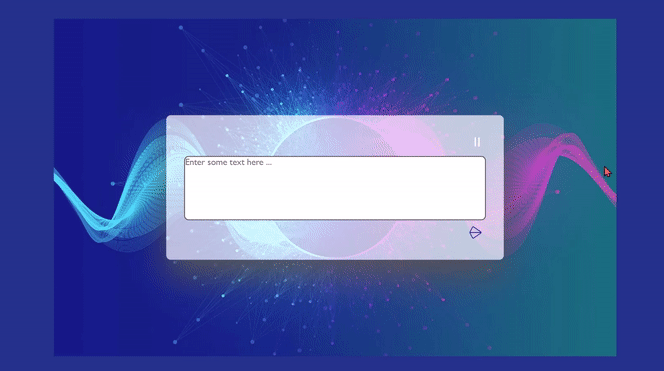

# [문자를 소리로 변환하기](https://www.notion.so/Text-To-Speech-Converter-577c6a5f1b25498f80766438e1e8a740)

> [유튜브 강의 영상](https://www.youtube.com/watch?v=iSPdLdpZJ1o&list=LL&index=6)
>

<br>

### **구현 화면**


<br>
<hr>
<br>

## HTML

<br>

### [**textarea**](http://www.tcpschool.com/html-tags/textarea)

> 사용자가 여러 줄의 텍스트를 입력할 수 있는 텍스트 입력 영역을 정의할 때 사용한다.
>
> 텍스트 입력 영역의 크기는 textarea요소의 `cols 속성`과 `rows 속성`으로 지정할 수 있고 CSS에서는 `height 속성`과 `width 속성`을 사용한다.
>

<br>

```html
<form action="" method="get">
    <textarea name="opinion" cols="30" rows="5"></textarea>
    <input type="submit">
</form>
```

<br>
<hr>
<br>

## CSS 속성

<br>

### [**em**](https://developer.mozilla.org/ko/docs/Learn/CSS/Building_blocks/Values_and_units)

> `상대 길이 단위`로 요소의 글꼴 크기
>
> 웹 크기에 따라 크기가 조절 가능
>
> **1em**은 font-size 설정값에 따라 달라짐
>
> [참고 블로그](https://www.daleseo.com/css-em-rem/)

<br>

    상대 길이 단위란 고정되지 않고 어떤 기준에 따라서 유동적으로 바뀔 수 있는 길이를 나타내는 단위

<br>

|단위|관련 사항|
|---|---|
|em|요소의 글꼴 크기.|
|ex|요소 글꼴의 x-height.|
|ch|요소 글꼴의 glyph "0" 의 사전 길이 (너비) 입니다.|
|rem|루트 요소의 글꼴 크기.|
|lh|요소의 라인 높이.|
|vw|viewport 너비의 1%.|
|vh|viewport 높이의 1%.|
|vmin|viewport 의 작은 치수의 1%.|
|vmax|viewport 의 큰 치수의 1%.|

<br>
<hr>
<br>

## JS

<br>

### [**speechSynthesis**](https://developer.mozilla.org/en-US/docs/Web/API/SpeechSynthesis)

> 주어진 텍스트를 소리로 바꿔주는 TTS(Text To Speech) API
>
> [참고 블로그](https://blog.seulgi.kim/2016/08/web-speechsynthesis-tts-api.html)

<br>

    SpeechSynthesis 메서드 종류
    
    1. SpeechSynthesis.cancel()
    2. SpeechSynthesis.getVoices()
    3. SpeechSynthesis.pause()
    4. SpeechSynthesis.resume()
    5. SpeechSynthesis.speak()

<br>

### **SpeechSynthesisUtterance** 

> 음성 서비스가 이용 할 텍스트나 언어, 음높이, 볼륨등에 대한 속성을 설정.
>

<br>

    SpeechSynthesisUtterance 메서드 종류
    
    1. SpeechSynthesisUtterance.lang: 언어 설정
    2. SpeechSynthesisUtterance.pitch: 음높이 설정
    3. SpeechSynthesisUtterance.rate: 말하는 속도 설정
    4. SpeechSynthesisUtterance.text: 이용할 텍스트 설정
    5. SpeechSynthesisUtterance.voice: 보이스 설정
    6. SpeechSynthesisUtterance.volume: 볼륨 설정