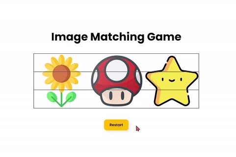

# [그림맞추기 게임](https://www.notion.so/Image-Matching-Game-2a61f8e48fbe483796ad1745729facb9)

> [유튜브 강의 영상](https://www.youtube.com/watch?v=aE4b9-dWKR0&list=LL&index=8&t=575s)
>

<br>

### **구현 화면**


<br>
<hr>
<br>

## CSS 속성

<br>

### **~ 연산자**

> `+ 연산자`와 비슷한 쓰임새로 x ~ y이면 x태그 옆 y태그만 선택 
>
> `+ 연산자`와 다른 점은 `x태그 옆의 모든 y태그가 선택`됨
>

<br>

### [**appearance**](https://developer.mozilla.org/en-US/docs/Web/CSS/appearance)

> 네이티브로 지원되는 모양들을 해제하거나 추가할때 이 속성을 이용
>
> 크로스브라우징(모든 브라우저 동일 화면 구현)에 유용
>

<br>

```css
/* 원래 속성값을 제거 */
appearance: none;
```

<br>

### [**steps()**](https://developer.mozilla.org/en-US/docs/Web/CSS/animation-timing-function)

> animation-timing 함수 중 하나로 애니메이션이 점차적으로 움직이도록 제어
>
> 움직임이 부드럽지 않고 끊김
>

<br>

```css
/* 5단계를 거쳐 움직임을 나타냄 */
animation-timing: steps(5)
```

<br>

### [**animation-play-state**](https://developer.mozilla.org/en-US/docs/Web/CSS/animation-play-state)

> 애니메이션 효과가 멈추거나 재생하는 것을 지정
>

<br>

```css
/* 애니메이션 효과 멈춤 */
animation-play-state: paused;
/* 애니메이션 효과 재생 */
animation-play-state: running;
```

<br>
<hr>
<br>

## JS

<br>

### [**disabled**](https://hianna.tistory.com/477)

> 불린값으로 작동되며 True일 때 비활성화가 됨
>