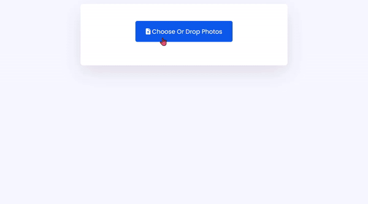

# [드래그 앤 드롭 파일 업로드](https://www.notion.so/Drag-and-Drop-File-Upload-eba8682ef85f42c99e1dc03792b2666e)

> [유튜브 강의 영상](https://www.youtube.com/watch?v=yCMzLYmthVo)
>

<br>

### **구현 화면**


<br>
<hr>
<br>

## HTML

<br>

### [**input태그 accept**](http://www.tcpschool.com/html-tag-attrs/input-accept)

> input의 type 속성값이 “file”인 경우에만 사용할 수 있으며 서버로 업로드할 수 있는 `파일의 타입`을 명시
>
> accept 속성에 하나 이상의 속성값을 명시할 경우에는 콤마(,)를 사용하여 구분
>

<br>

|속성값|설명|
|---|---|
|파일 확장자|닷(.)으로 시작되는 파일 확장자 ex) .png, .jpg, .pdf, .hwp|
|audio/*|모든 타입의 오디오 파일이 허용됨.|
|video/*|모든 타입의 비디오 파일이 허용됨.|
|image/*|모든 타입의 이미지 파일이 허용됨.|
|미디어 타입|매개변수(parameter)를 가지지 않는 유효한 미디어 타입|

<br>

```html
<input type="file" accept="파일 확장자|audio/*|video/*|image/*|미디어 타입">
```

<br>

### [**figcaption태그**](http://www.tcpschool.com/html-tags/figcaption)

> 이미지나 다이어그램, 사진과 같이 문서의 주요 흐름과는 독립적인 콘텐츠를 정의하는 figure 요소의 캡션(caption)을 정의할 때 사용
>
> figure요소의 첫 번째 자식 요소이거나 마지막 자식 요소로만 위치할 수 있음
>

<br>

### [**figure태그**](http://www.tcpschool.com/html-tags/figure)

> figure요소의 콘텐츠는 문서의 내용과는 연관성을 가지지만, 해당 콘텐츠의 위치가 문서의 주요 흐름과는 독립적이어서 `제거해도 문서의 흐름에 영향을 주어서는 안 됨`.
>

<br>
<hr>
<br>

## JS

<br>

### [**readAsDataURL**](https://developer.mozilla.org/ko/docs/Web/API/FileReader/readAsDataURL)

> 컨텐츠를 특정 Blob 이나 File에서 읽어 오는 역할
>

<br>

#### readAsDataURL 작동 3단계

1. 읽어오는 read 행위가 종료되면, readyState == DONE이 된다. 
2. [loadend](https://developer.mozilla.org/ko/docs/Web/API/FileReader/loadend_event) 이벤트가 트리거된다. 
3. base64 인코딩된 스트링 데이터가 result 속성(attribute)에 담긴다.

<br>

    트리거 : 자동으로 필요한 동작을 실행


<br>

### [**Array.from**](https://developer.mozilla.org/ko/docs/Web/JavaScript/Reference/Global_Objects/Array/from)

> 유사 배열 객체(array-like object)나 반복 가능한 객체(iterable object)를 얕게 복사해 새로운 Array 객체를 만듦
>

<br>

```javascript
console.log(Array.from('foo'));
// Expected output: Array ["f", "o", "o"]

console.log(Array.from([1, 2, 3], x => x + x));
// Expected output: Array [2, 4, 6]
```

<br>

### [**dragenter 이벤트**](https://developer.mozilla.org/en-US/docs/Web/API/HTMLElement/dragenter_event)

> 드래그 가능한 요소 또는 선택된 텍스트가 유효한 드롭영역에 들어갈 때 발생하는 이벤트
>

<br>

### [**preventDefault**](https://developer.mozilla.org/ko/docs/Web/API/Event/preventDefault)

> 어떤 이벤트를 명시적으로 처리하지 않은 경우, 해당 이벤트에 대한 사용자 에이전트의 기본 동작을 `실행하지 않도록 지정`
>

<br>

### [**stopPropagation**](https://developer.mozilla.org/ko/docs/Web/API/Event/stopPropagation)

> 현재 이벤트가 캡처링/버블링 단계에서 더 이상 전파되지 않도록 방지
>
> 부모 엘리먼트로의 이벤트 전달을 막아주는 함수
>
> 이벤트의 기본 동작은 실행되고 링크나 버튼의 클릭을 막는 것은 아님
>
> [참고 블로그](https://velog.io/@yiyb0603/JS-e.preventDefault%EC%99%80-e.stopPropagation%EC%9D%98-%EC%B0%A8%EC%9D%B4%EC%A0%90)
>

<br>

```javascript
import React, { FC, useCallback } from 'react';

const App: FC = (): JSX.Element => {
  return (
    <div onClick={() => alert("부모에서 실행되었습니다")}>

      <button onClick={() => alert("자식에서 실행되었습니다")}>클릭!!</button>

    </div>
  );
};

export default App;

// 실행 결과
// 자식에서 실행되었습니다
// 부모에서 실행되었습니다
```

```javascript
import React, { FC, useCallback, MouseEvent } from 'react';

const App: FC = (): JSX.Element => {
  const onChildClick = useCallback((e: MouseEvent<HTMLButtonElement>): void => {
    e.stopPropagation();
    alert("자식에서만 실행됩니다.");
  }, []);
  
  return (
    <div onClick={() => alert("부모에서 실행되었습니다")}>

      <button onClick={onChildClick}>클릭!!</button>

    </div>
  );
};

export default App;
// 실행 결과
// 자식에서만 실행됩니다.
```