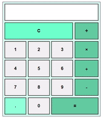

# [그리드](https://tungsten-felidae-9bc.notion.site/Grid-Calculator-058e4d2b28d54571b97d77d6f9f22097)

> [계산기 만들기](https://youtu.be/rWFAR1mql8Q)
>

<br>

### **구현 화면**


<br>
<hr>
<br>

## HTML 태그

<br>

### [**Input**](https://developer.mozilla.org/ko/docs/Web/HTML/Element/Input) / [**Button**](https://developer.mozilla.org/ko/docs/Web/HTML/Element/button)

> 입력 받은 내용을 상호작용하기 위해서 input 태그를 사용
>
> `스스로 닫는 태그`로 하위 태그를 사용할 수 없음.
>

<br>

```html
<input type="text">
```

<br>

|input 속성|효과|
|---|---|
|button|기본 행동을 가지지 않는 푸쉬 버튼.|
|checkbox|단일 값을 선택할 수 있는 박스.|
|color|색을 지정할 수 있는 컨트롤.|
|date|날짜를 지정할 수 있는 컨트롤.|
|datetime|날짜와 시간을 지정할 수 있는 컨트롤.|
|email|이메일 주소를 편집할 수 있는 필드.|
|file|파일을 지정할 수 있는 컨트롤.|
|hidden|보이지 않지만 값은 서버로 전송하는 컨트롤.|
|image|src에 지정한 이미지로 나타나는 시각적 제출버튼.|
|month|연과 월을 지정할 수 있는 컨트롤.|
|number|숫자를 입력하기 위한 컨트롤.|
|password|값이 가려진 한 줄 텍스트 필드.|
|radio|여러 개의 선택 중 하나의 값만 선택.|
|range|값이 가려진 숫자를 입력하는 컨트롤.|
|reset|기본값으로 초기화하는 버튼(권장하지 않음).|
|search|검색문자열을 입력하는 한 줄 텍스트 필드.|
|submit|양식을 전송하는 버튼.|
|tel|전화번호를 입력하는 컨트롤.|
|text|기본값, 한 줄 텍스트 필드.|
|time|시간대가 없는 시간값을 입력하는 컨트롤.|
|url|url을 입력하는 필드.|
|week|시간대가 없는 주-년 값과 주의 값을 구성하는 날짜 컨트롤.|

<br>

> `button 태그`는 **form**에서 활용하기 위해 만들어진 태그
>
> `스스로 닫지 못하는 태그`로 하위에 태그를 추가 할 수 있다.
>
> 디자인 측면에서 자유도가 더 높음.

<br>

```html
<button>
  
  <p> 이미지 버튼 </p>
</button>
```

<br>

|button 속성|효과|
|---|---|
|submit|form을 제출하는 이벤트 발생.|
|reset|form 안에 작성된 내용을 초기화.|
|button|버튼 자체로는 아무 이벤트가 없지만 click 이벤트와 연결해 자바스크립트에서 활용.|

<br>
<hr>
<br>

## CSS 속성

<br>

### [**grid-template-columns**](https://developer.mozilla.org/en-US/docs/Web/CSS/grid-template-columns)

> 컨테이너에 Grid 트랙의 크기들을 지정해주는 속성
>
> [grid-template-columns 참고 블로그](https://studiomeal.com/archives/533)

<br>

#### repeat(반복횟수, 반복값)

```css
  .container {
	grid-template-columns: repeat(5, 1fr);
	/* grid-template-columns: 1fr 1fr 1fr 1fr 1fr */
  }
```

<br>

### [**grid-auto-flow**](https://developer.mozilla.org/en-US/docs/Web/CSS/grid-auto-flow)

> 자동으로 블럭들을 배치해주는 알고리즘
>
> [grid-auto-flow 참고 블로그](https://yamoo9.gitbook.io/css-grid/css-grid-guide/grid-auto-flow)

<br>

### [**grid-column**](https://developer.mozilla.org/en-US/docs/Web/CSS/grid-column)

> grid-column-start/end의 단축 속성(열 시작/끝 위치)
>
> [grid-column 참고 블로그](https://heropy.blog/2019/08/17/css-grid/)

<br>

<br>
<hr>
<br>

## JS

<br>

### [**eval**](https://developer.mozilla.org/en-US/docs/Web/JavaScript/Reference/Global_Objects/eval)

> 문자열(String)을 코드로 인식해 실행할 수 있게 해주는 함수
>
> 보안 문제로 인해 권장하지 않음.
>
> [eval 참고 블로그](https://velog.io/@minukbak/904)

<br>

```javascript
let a = 3;
let b = 5;
eval('a += ' + b + ' + 2');
console.log(a); // 10
```

<br>

## Eval()을 대체할 new Function()

<br>

### [**new Funtion**](https://ko.javascript.info/new-function)

> 문자열을 코드로 인식해 실행한다는 점에서 eval 함수와 유사.
>
> 별도의 함수 영역으로 분리되어 함수 내부 Scope에만 접근과 수정이 가능.
>
> 내부에서 선언된 변수 등은 해당 Function 안에서만 유효.
>
> 따라서 eval과 같은 `보안 문제가 발생하지 않음`.

<br>

```javascript
let func = new Function ([arg1, arg2, ...argN], functionBody);
```

<br>

#### eval() / new Function() 비교

```javascript
function Myfunc1() {
  let a = 123;
  eval('console.log(a); a = 456;');
  console.debug(a);
}
Myfunc1(); // 123, 456

function Myfunc2() {
  let b = 123;
  new Function('console.log(b);')(); // ReferenceError: b is not defined
}
Myfunc2();
```