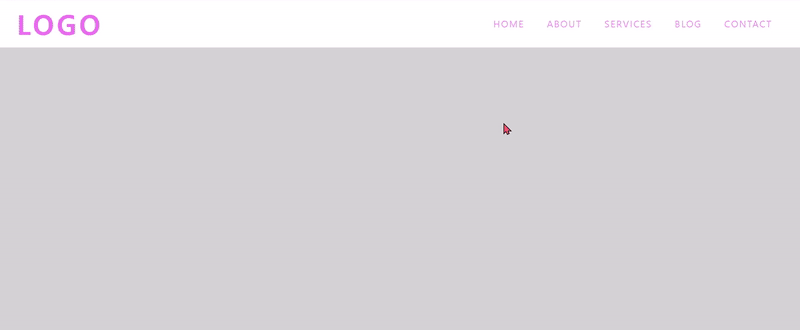

# [반응형](https://tungsten-felidae-9bc.notion.site/Responsive-Navbar-d4e6cb5a428e4be3818c2510b9c3ba54)

> [반응형 네브바](https://www.youtube.com/watch?v=zQngLMkngQE)
>

 

### **구현 화면**

 

 

## CSS 속성

 

### [**overflow-x**](https://developer.mozilla.org/en-US/docs/Web/CSS/overflow-x)

> 가로의 너비가 넘칠 때 어떻게 보여질 것인지 설정
>

 

### [**text-transform**](https://developer.mozilla.org/en-US/docs/Web/CSS/text-transform)

> 텍스트가 어떻게 보여질 것인지 설정 (대문자 / 소문자)
>

 

|속성|효과|
|---|---|
|capitalize|첫 글자를 대문자로 변환.|
|uppercase|모든 글자를 대문자로 변환.|
|lowercase|모든 글자를 소문자로 변환.|

 

### [**scale()**](https://developer.mozilla.org/en-US/docs/Web/CSS/transform-function/scale)

> 2D 평면에서 요소의 크기를 조정.
>
> scale(X, Y)로 설정.
>
> scaleX() / scaleY() 각각 설정할 수 도 있음. 
>
> 좌표 값은 **1 ~ -1** 사이에서 설정.

 

### [**transform-origin**](https://developer.mozilla.org/en-US/docs/Web/CSS/transform-origin)

> 요소 변형의 원점(시작점)을 설정.
>
