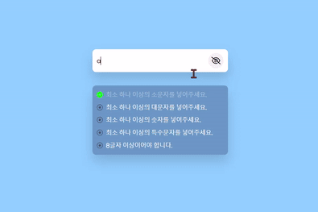

# [비밀번호 유효성검사](https://www.notion.so/Password-Validation-864ab4fddac34c32b71f83204f548d35)

> [유튜브 강의 영상](https://www.youtube.com/watch?v=Hi8DVOaZ0Ug)
>

<br>

### **구현 화면**


<br>
<hr>
<br>

## Fontawesome 아이콘웹폰트 사용하기

<br>

### [**아이콘웹폰트**](https://blog.naver.com/nsoft21/221544666162)

> 폰트어썸 아이콘을 사용할 때 html에서 `i 태그`를 사용하지 않고 CSS에서 `font-family를 이용`해서 아이콘을 사용.
>

<br>

```html
<!-- 폰트어썸을 사용하게 해주는 링크 -->
<link rel="stylesheet" href="https://cdnjs.cloudflare.com/ajax/libs/font-awesome/6.2.1/css/all.min.css" integrity="sha512-MV7K8+y+gLIBoVD59lQIYicR65iaqukzvf/nwasF0nqhPay5w/9lJmVM2hMDcnK1OnMGCdVK+iQrJ7lzPJQd1w==" crossorigin="anonymous" referrerpolicy="no-referrer" />
<!-- 아이콘을 보여줄 클래스 -->
<div class="icon"></div>

<style>
    .icon {
      /* 사용할 아이콘의 고유 번호 */
      content: '\f06e';
      /* 폰트값을 폰트어썸으로 설정 */
      font-family: fontAwesome;
      /* solid : 900 / regular : 400 / light : 300 */
      font-weight: 900;
    }

</style>

```

<br>
<hr>
<br>

## CSS 속성

<br>

### [**inline-flex**](https://developer.mozilla.org/ko/docs/Web/CSS/display)

> lnline-block과 같은 형식으로 수평정렬이 된다.
>
> 직계 자식 요소들이 반응형으로 작동하지 않아 잘 쓰지 않는 스타일 옵션
>

<br>


<br>
<hr>
<br>

## JS

<br>

### [**RegExp**](https://developer.mozilla.org/ko/docs/Web/JavaScript/Reference/Global_Objects/RegExp)

> 정규표현식은 문자열에서 특정 내용을 찾거나 대체 또는 발췌하는데 사용
>
> 정규표현식을 이용하면 매우 간단하게 표현 가능하지만 가독성이 좋지 않음
>
> [딥다이브 정규표현식](https://poiemaweb.com/js-regexp)

<br>

```javascript
// 소문자가 들어있는지 판별
const lower = new RegExp('(?=.*[a-z])');
// 대문자가 들어있는지 판별
const upper = new RegExp('(?=.*[A-Z])');
// 숫자가 들어있는지 판별
const number = new RegExp('(?=.*[0-9])');
// 특수문자가 들어있는지 판별
const special = new RegExp('(?=.*[!@#\$%\^&\*])');
// 문자열 길이가 8글자 이상인지 판별
const length = new RegExp('(?=.{8,})');
```