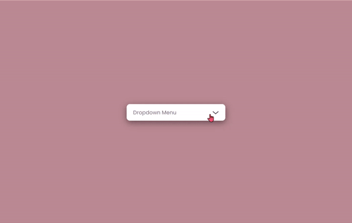

# [드롭다운](https://tungsten-felidae-9bc.notion.site/Dropdown-Menu-a1924cbf0f42406ea915b2a03e0b12ea)

> [드롭다운 메뉴](https://www.youtube.com/watch?v=nTfCqfVrO8E)
>

<br>

### **구현 화면**


<br>
<hr>
<br>

## JS

<br>

### [**Onclick & addEventListener('click')**](https://velog.io/@leitmotif/onClick-vs-addEventListener)

> On 이벤트와 addEventListner 이벤트의 차이점 정리
>

<br>

```javascript
elem.onclick = function(){
	console.log('안녕! 첫 번째 함수야!")
}

elem.onclick = function(){
	console.log('안녕! 두 번째 함수야!")
}
```

    위의 코드를 실행했을 때, On 이벤트는 가장 마지막 코드만을 실행.
    하나의 이벤트에 여러가지 작업을 동시에 할 수 없다.


<br>

```javascript
elem.addEventListener('click',function(){
	console.log('안녕! 첫 번째 함수야!")
})

elem.addEventListener('click',function(){
	console.log("안녕! 두 번째 함수야!")
})
```

    addEventListener 이벤트는 모든 코드를 실행.
    여러가지 상호작용이 필요한 작업을 할 때는 addEventListener 이벤트를 사용.

    또한, 세 번째 인자로 Event capturing을 제어하는 boolean 인자가 있다. 기본 값은 false.

#### 캡처링과 버블링

<br>

> Capturing : Event가 하위 요소로 전파. -> 위에서 아래로!
>
> Bubbling : Event가 상위 요소로 전파. -> 아래에서 위로!
>

```html
<div>
    <p>
        <button>
    </p>
</div>
```

    위와 같은 형태에 button 태그에 true 값이 정해져 있다면
    div -> p -> button 순서로 캡쳐링이 진행된 뒤
    button -> p -> div 순서로 버블링이 진행.

    false일 때는 캡쳐링이 설정되지 않았으므로
    button -> p -> div 순서로 버블링만 발생.


<br>
<hr>
<br>


<br>

## addEventListener 이벤트를 지향해야하는 이유

1. 여러가지 이벤트를 **동시에 작업 가능**
2. html **스트레스가 적음** (코드를 읽어 내리는 시간과 가독성)
3. **XSS 위험성 방지** (인라인 이벤트 핸들러 지양)